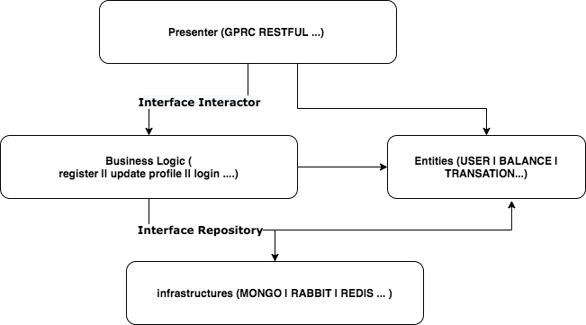

## Rules


## Directors rule 
- pkg/agents ==> infrastructures
- pkg/models ==> entities
$2y$10$h5WIA3UKMNGPRt8/0yGlc.Vuq3Ms1Z5wamFgN1VVp9DGbFoxCcsL6- pkg/interactor ==> business logic
- handlers ==> presenters

## Add/update proto submodule

```bash
git submodule add git@gitlab.com:wallet-gpay/protobufs.git protobufs
git submodule update --init --recursive
git submodule update --remote --merge

# gen proto
make gen-proto
```